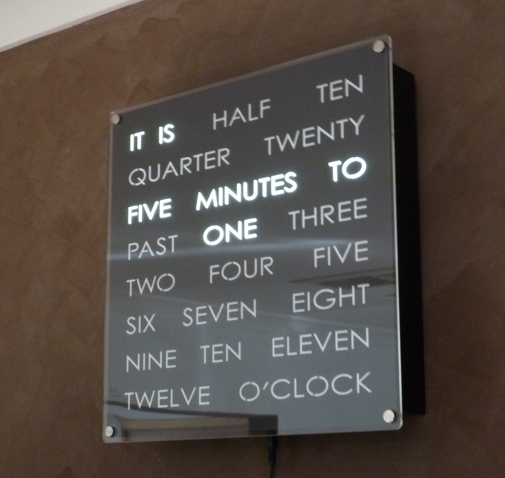
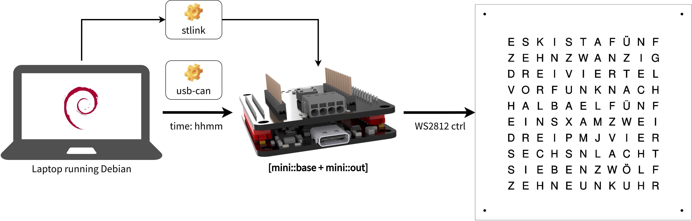
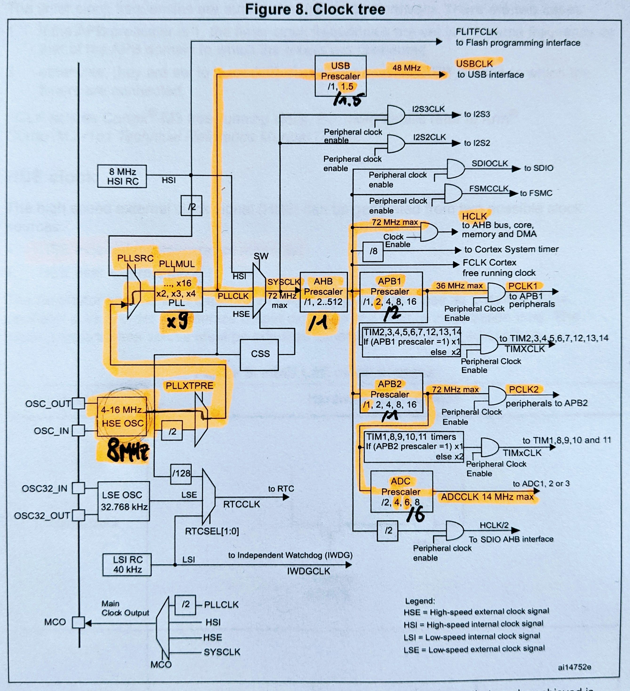

# the nerdclock

Perhaps you already know what a word clock is, but just in case you don't:



_**Source**: [Doug's Word Clocks](http://www.dougswordclocks.com/shop/wc-30cm/#prettyPhoto)_

It's a clock, but it shows the time as words, not as numbers or using a graphical
visualization. And honestly - it _is_ pretty neat, isn't it? We think so!

Why are we telling you about word clocks, though? Well, we have a good friend
and trusted advisor who is a mechanical engineer and decided he wanted to build
one based on an online tutorial. He did do so, creating a frame milled from [MDF
board](https://en.wikipedia.org/wiki/Medium-density_fibreboard) and a fairly
prototype-style wire-up of [WS2812
LEDs](https://cdn-shop.adafruit.com/datasheets/WS2812.pdf), all connected to a
Raspberry Pi.

He then got in touch with us, and we worked together to make his word clock
project even cooler. A [BluePill
board](https://stm32-base.org/boards/STM32F103C8T6-Blue-Pill.html) with the CAN
wired up is used here. Everything you'll need should be documented in this
repo here.

- Our friend's existing prototype
- The BluePill board with CAN wired up
- The following software:
  - [stm32f1xx-hal](https://github.com/stm32-rs/stm32f1xx-hal), which is a Rust implementation of the core functionality for the STM32F1 series
  - The [knurling-rs app template](https://github.com/knurling-rs/app-template) developed by [the knurling-rs project](https://knurling.ferrous-systems.com/) for bare-metal Rust
- A USB-CAN bridge ([`usb-can`](https://github.com/bmc-labs/usb-can), which is
    based on [the USBtin](https://www.fischl.de/usbtin/))
- A Debian laptop that communicates the time to the clock via CAN.

So let's dive in!

## The Setup

The following picture shows an overview of the setup we used, which is fairly
simple. The word clock is in German, by the way. If you don't speak German,
consider this an opportunity to learn some in preparation for the next
Oktoberfest!



Before you say anything: yes, it's true, there's no real reason to use a CAN
bus for this project. Nevertheless, we added CAN into the mix as it's just fun
to play with CAN bus when given the opportunity.

### Brave New World

We know the world of embedded software is still enamored with C. There is,
however, a brave new world called Rust, and we've been playing with it a whole
bunch over the last two years. Mostly on Linux, as embedded was still pretty
young when we first had a look. But it has come a long way recently, so we've
decided to go all in and do as much as possible in Rust. Including this project!

There will be much more material from us regarding Rust on embedded. It'll be
great! For now though, let's dive into a bit of code.

### Timings Are Important When Things Move Fast

We have two pretty time critical components in this showcase: the WS2812 LEDs
and CAN. _But how?_, you may ask. _Aren't the LEDs just LEDs, an the CAN bus
mature enough not to have issues like this with is?_ Yeah, sort of. The WS2812
are controlled via a one-wire interface and since there is a bunch of
information to be pushed through, speed and precision matter.

By default, the STM32F103CBT6 is clocked much lower than the advertised 72 MHz,
so we'll have to fix that:

```rust
  let dp = pac::Peripherals::take().unwrap();
  let mut rcc = dp.RCC.constrain();

  let clocks = rcc.cfgr
                  .use_hse(8.mhz())
                  .sysclk(72.mhz())
                  .hclk(72.mhz())
                  .pclk1(36.mhz())
                  .pclk2(72.mhz())
                  .adcclk(12.mhz())
                  .freeze(&mut flash.acr);
```

What happened here? First, we acquired the device peripherals to lock them.
Then we go ahead and find the _Reset and Clock Control (RCC)_. In the
configuration of the RCC, we can now set:

- The high speed external (HSE) crystal to 8 MHz
- The system clock (SYSCLK) to 72 MHz
- The AHB bus clock (HCLK) to 72 MHz
- The APB1 bus clock (PCLK1) to 36 MHz
- The APB2 bus clock (PCLK2) to 72 MHz
- The ADC clock (ADCCLK) to 12 MHz

And finally, we call `freeze` to "log in" our settings and produce a `Clocks`
struct containing all necessary information to work with the clocks.

"Back up," you say? No worries. Here's where we got that from:



It's from [ST RM0008, the reference manual for the STM32F101 to STM32F107
MCUs](https://www.st.com/resource/en/reference_manual/cd00171190-stm32f101xx-stm32f102xx-stm32f103xx-stm32f105xx-and-stm32f107xx-advanced-armbased-32bit-mcus-stmicroelectronics.pdf)
(page 93), and it shows the clock tree of the MCUs. From there we, derive what
we need to do in terms of frequencies (you are welcome to follow my lovely
text-marker annotation), and then we drop those frequencies into [the well
documented Rust
library](https://docs.rs/stm32f1xx-hal/0.7.0/stm32f1xx_hal/rcc/struct.CFGR.html).

There's one last road block though.

### Yes, We CAN

Setting up the CAN involves usually defining bunch of things as well, arguably
the most important of which is the baud rate. CAN is pretty resilient, however
it does also a need a fairly accurate clock - which we've provided via the
`use_hse` call. So we set the baud rate like so:

```rust
  // APB1 (PCLK1): 36MHz, Bit rate: 500kBit/s, Sample Point 88.9%
  // Value was calculated with http://www.bittiming.can-wiki.info/
  can1.modify_config().set_bit_timing(0x001e_0003);
```

And indeed, it works! At lower baud rates the CAN fails with the MCU going at
72 MHz, so below 250 the MCU has to be clocked down - however if you use our
upcoming Rust library with the mini series, this will be taken care of!

Good! Now we need the time.

### Havin' a Good Time

The word clock needs the hour and the minute to do its thing. We need to get it
there via CAN; that's the goal we've set for ourselves.

The Linux `date` command gives us the date and time:

```bash
» date
Tue Apr 20 01:08:23 PM CEST 2021
```

The `date` command also understands options to output only date / time
components:

```bash
» date +"%I"
01  # hour in AM/PM format
» date +"%M"
11  # minute in the hour
```

Sending this via CAN requires a CAN interface of some sort. We're using [the
USBtin](https://www.fischl.de/usbtin/), of which we've made our own version,
[the `usb-can`](https://github.com/bmc-labs/usb-can). The README instructions
we publish have all the necessary setup information for a serial CAN link over
which we can speak using `socketcan`. We end up with the possibility to send
CAN frames to an interface called `slcan0` using a utility called `cansend`.
Plugging our `date` magic into all of this, we get:

```bash
while true
do
  cansend slcan0 7ff#$(printf '%02x%02x' $(date +"%I") $(date +"%M"))
  sleep 5
done
```

This will send the hour and minute to the serial CAN interface on CAN ID 7ff
every five seconds. There are of course more elegant solutions but this one
works for us for now, so let's stick with it.

### The Receiving End

On the board, we now have to make sense of this CAN frame. First, we wait
(blocking) for a new frame; then we decode it and finally we translate it to
the board LEDs:

```rust
    // blocking read - this is the code we loop
    if let Ok(frame) = block!(can.receive()) {
      // decode hour, minute from the CAN frame. there is only the one CAN
      // frame travelling on this bus, otherwise this code is more complex
      let (hour, minute) = match frame.data() {
        Some(data) => (data[0], data[1]),
        None => {
          defmt::error!("FATAL: unable to read time data");
          gridbox::exit();
        }
      };
      defmt::info!("received time: it is {}:{}", hour, minute);

      // reset word clock data
      reset_wclk(&mut wclk_data);

      match minute {
        0..=4 => set_word(&mut wclk_data, UHR, ON),
        5..=9 => {
          set_word(&mut wclk_data, FUENF, ON);
          set_word(&mut wclk_data, NACH, ON);
        }
        10..=14 => {
          set_word(&mut wclk_data, ZEHN, ON);
          set_word(&mut wclk_data, NACH, ON);
        }
        15..=19 => {
          set_word(&mut wclk_data, VIERTEL, ON);
          set_word(&mut wclk_data, NACH, ON);
        }
        20..=24 => {
          set_word(&mut wclk_data, ZWANZIG, ON);
          set_word(&mut wclk_data, NACH, ON);
        }
        25..=29 => {
          set_word(&mut wclk_data, FUENF, ON);
          set_word(&mut wclk_data, VOR, ON);
          set_word(&mut wclk_data, HALB, ON);
        }
        // ... it goes on here
      }
      // some more code
    }
```

The full code example is in [the `nerdclock` subdirectory](./nerdclock) for you
to study.

And then, finally, let's see if it works!

<figure class="video_container">
  <video controls="true" allowfullscreen="true">
    <source src="./resources/can-wordclock-video.mp4" type="video/mp4">
  </video>
</figure>

It does! Hurray!

With that Fun Thing™, we'll leave you for now. We hope you enjoyed this. And, if
you did, please consider posting about it :) More soon!

Cheers!
