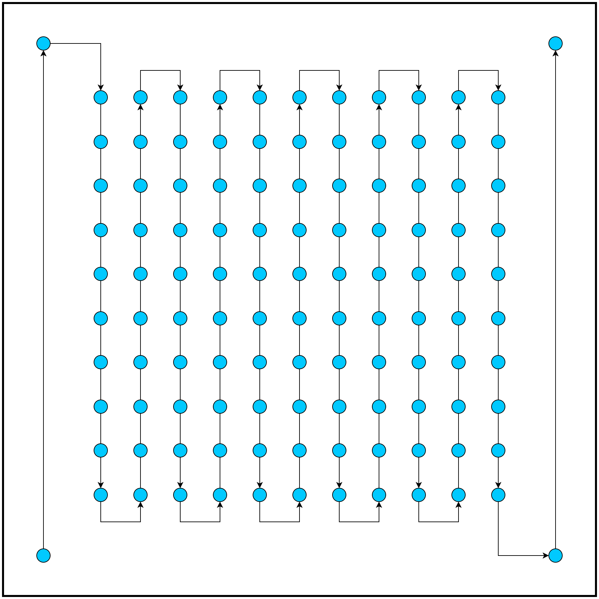

# `wordclock`

A word clock for mini::base + mini::out, which were developments boards based
around [the BluePill
board](https://stm32-base.org/boards/STM32F103C8T6-Blue-Pill.html) we once made
at **bmc::labs**. You'll need to wire up the CAN of the thing and make sure it
works, but then, there is no reason why this code here shouldn't work.

### Word Clock Setup / Wiring
The wordclock is a single stripe of WS2812 LEDs, configured like this:



Our friend who made the physical frame of the word clock made it so, and he was
inspired by and online tutorial / blog post as well.

**The WS2812 stripe should be powered from an external power source. At 5V,
the stripe used here (with 114 LEDs on it) draws over 4A when set to full
brightness. However the stripe must be connected to the mini::out ground for
the LEDs to work correctly. In our example, we connect the grounds together.**

### Toolchain Setup
We use [knurling-rs app template](https://github.com/knurling-rs/app-template).
The prerequisites from there apply.

### How to run
Connect your mini::base + mini::out to your computer via your ST-LINK.
Everything should be set up for you to use it, if that isn't the case please
find instructions for that [in our
Wiki](https://github.com/bmc-labs/board-mini/wiki/3.1-Mini-Out). After you've
done that, connect the data in of the LED strip to pin PA3 and then run

```bash
» cargo run --bin wordclock --release
```

and it should work!

---
Proudly written in [Rust](https://www.rust-lang.org/).
